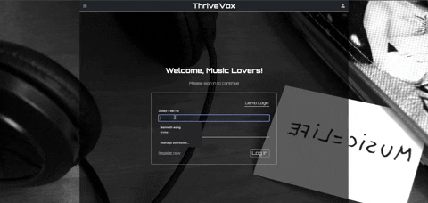
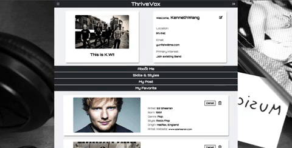
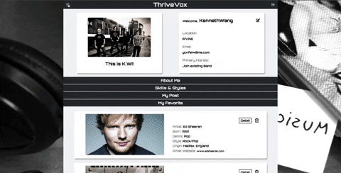
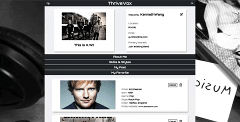
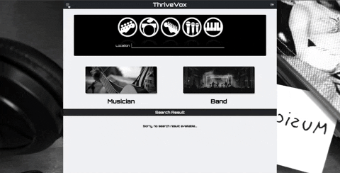

# ThriveVox

A full stack web application for musicians and music lovers who want to find single/band members, share and discuss their musical interests and favorites


# purpose

This application is designed to create a social media platform for music lovers to meet friends, find their favorites, discuss their interests, and post their personal Information, news and performance. The app has five main sections:

- About me - display user’s personal info, favorites and posts
- My favorite - for users to search their favorite artist or album
- Who is around - for users to search musician or band by city
- Live Feed - for users to leave post, comment and personal audio performance for all users
- Let's Chat -  5 topic chat room for all users to join and chat


## Technologies Used

- React.js
- Webpack
- Socket IO
- Node.js
- Node Fetch
- argon 2
- AWS
- HTML5
- CSS3
- Heroku

## Live Demo

Try the application live at [https://thrive-vox.herokuapp.com/]

## Features

- User can sign up for a personal account
- User can sign in with username and password
- User can display personal information in user home page
- User can edit personal information in user home page, upload profile picture
- User can search favorite artist/album information
- User can save and display saved artist/album information
- User can view the last 5 saved artist/album information in the carousel section
- User can delete saved favorites
- User can search musician/band user by city
- User can view result users' detail information
- User can view result users' all posts/audio files
- User can contact result user by email
- User can leave a post for all users to view
- User can upload an audio file for all users to view, download
- User can leave comment for any post
- User can delete a personal post/audio post
- User can delete a personal comment
- User can join a chatroom from 5 different topic
- User can see what users are in the save chat room with you
- User can leave live message with other users in the same chatroom
- User can see who left the chatroom
- User can see who is typing in the chatroom


## Preview

User can login to personal account



User can display personal info



Use can search favorite by artist or album



Use can search musician/band by location



Use can post/view/comment a post



Use can join topic chatroom


## Development
- Designed a full-stack web app that encourages an active lifestyle  and provide a live social media platform by allowing users to share news, thoughts, interests and favorites with other users
- Built reusable React components to provide a uniform UI, implementing UX best practices
- Initiated API requests to the AudioDB APIs to generate and display artist/album information
- Created Fetch API requests to a custom Express server's RESTful API endpoints using a multi-table PostgreSQL database
- Tested and deployed both the front-end and back-end of the multi-page application, implementing GitHub version control
- Applied Socket IO to create web socket connection , allowing using to join different chatroom and perform live message chatting

## Future Development


- User can live streaming music
- User can create playlist for their favorite artist/album/band
- User can perform video chatting
- More features to come...


### System Requirements

- VS code or any other code editor
- Hardware#

  recommend:

    1.6 GHz or faster processor
    1 GB of RAM

- Platforms#

    OS X El Capitan (10.11+)
    Windows 7 (with .NET Framework 4.5.2), 8.0, 8.1 and 10, 11 (32-bit and 64-bit)
    Linux (Debian): Ubuntu Desktop 16.04, Debian 9
    Linux (Red Hat): Red Hat Enterprise Linux 7, CentOS 8, Fedora 24

- JavaScript ES6
- HTML5
- CSS3
- Node.js 10 or higher
- NPM 6 or higher


### Getting Started

1. Clone the repository.

    ```shell
    git clone git@github.com:Kenneth-Y-Wang/ThriveVox.git
    cd sgt-react
    ```

2. Install all dependencies with NPM.

    ```shell
    npm install
    ```

3. Make a copy of the provided .env.example file. Name your copy .env.

    switch all config variables to your project's variables ( API keys, AWS access keys, heroku database URL, etc.)

    ```shell
    cp .env.example .env
    ```

4. Create a new database for your personal project name

    ```shell
    createdb <yourprojectname>
    ```

5. Import the database schema and test data using the provided "db:import" script in package.json.

    ```shell
    npm run db:import
    ```

6. Start the project. Once started you can view the application by opening http://localhost:3000 in your browser.

    ```shell
    npm run dev
    ```
